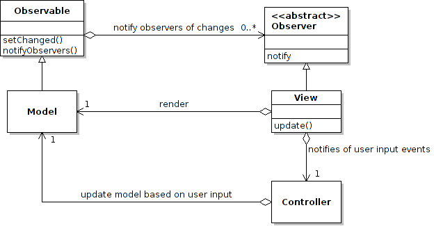

Model View Controller C++ Example
=================================

This example is based on the Java MVC example available at http://www.tutorialspoint.com/design_pattern/mvc_pattern.htm

A Eclipse CDT project is included here. Just import the project after doing git clone.

The MVC implemented uses the Observer pattern in a similar way described in the following figure:

